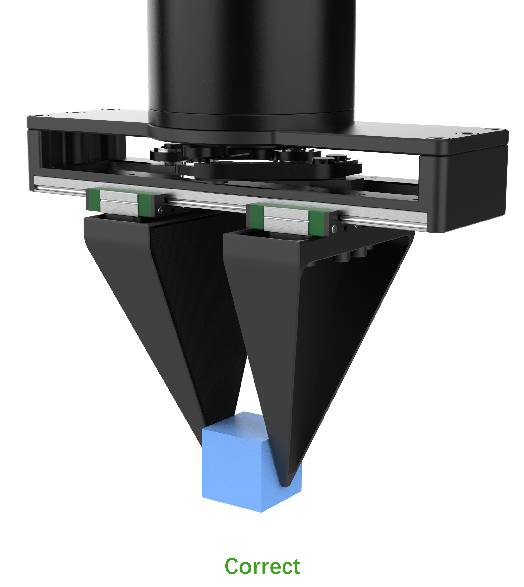
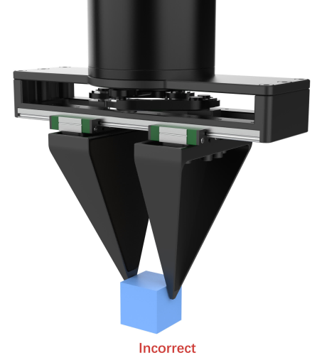
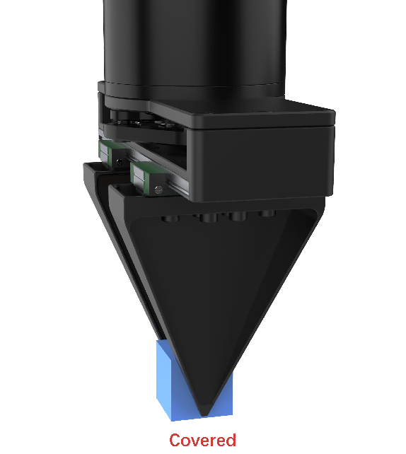

# 数据采集建议

**示教**

1. 运动过程平稳流畅自然，没有明显加速、停顿、抖动等速度突变情况；
2. 数据采集轨迹分布应具有一定的随机性，但请注意动作分布差异不要过大；
3. 夹爪开合的动作应比较明显，即张开时尽量张开，关闭时尽量关闭，保证主动臂和从动臂编码器返回明确的开合值；
4. 每个动作之间有一定停顿；
5. 在操作物体时应考虑模型预测可能出现的偏差，不要出现仅夹住物体边缘的情况；

    
    

**相机**

1. 采集图像清晰，相机对焦点正常，画面无卡顿、模糊、抽帧等问题；
2. 环境相机中保证操作物体全程位于画面中（杯子等较大物体允许有几帧不整体入镜）；
3. 环境相机注意操作角度，避免位于夹爪遮挡小物体的角度，如下图所示；
4. 臂上相机应保证可以看到操作物体和夹爪的开合特征；
5. 环境相机视野中，示教臂不可入镜（因推理时不存在），执行臂在任务开始时可不必须入镜，但在操作物体时要求可以看到夹爪与物体的交互；
6. 相机视野应考虑改变物体摆放位置后，物体仍位于相机视野中，且物体的初始摆放位置应尽量位于相机视野中央；

    
    

### 数据采集操作

1. 按空格键开始数据采集
2. 完成任务后按`s`键保存, 等待保存完毕后, 再次按下空格键开始采集
3. 若在采集过程中, 发现本次操作有不符合采集要求时，主观认为是无效数据，则按`q`键放弃当前采集，然后重新按空格键开始采集
4. 若数据已经保存，发现采集的数据不符合要求，则可按`r`键删除本次采集的数据，然后按空格键重新采集
5. 所有数据采集完毕后, 按`ESC`键退出采集程序
