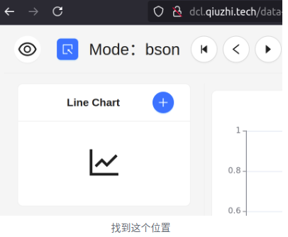
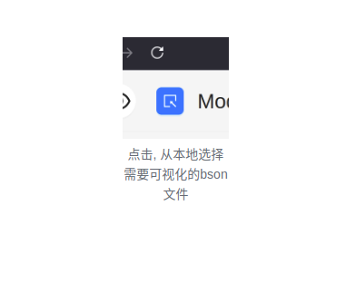
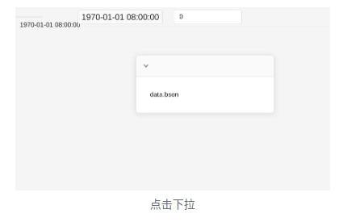
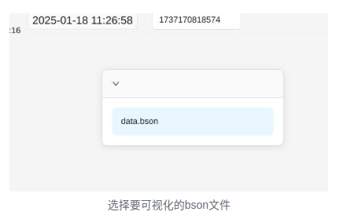
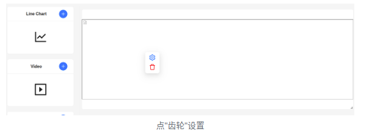
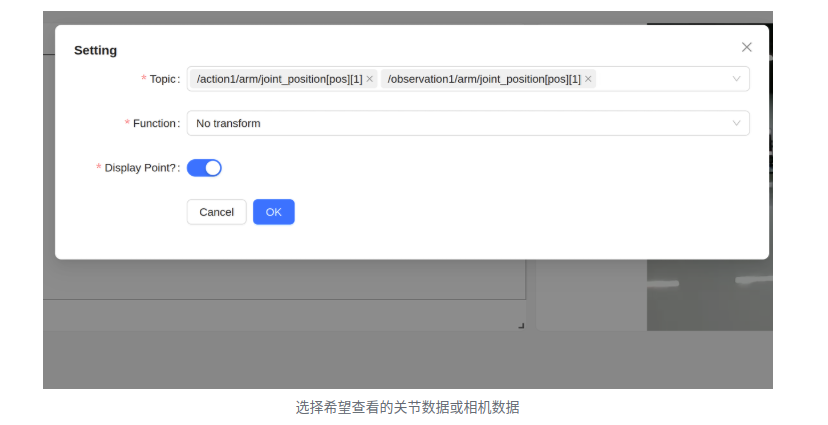
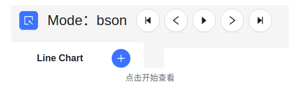
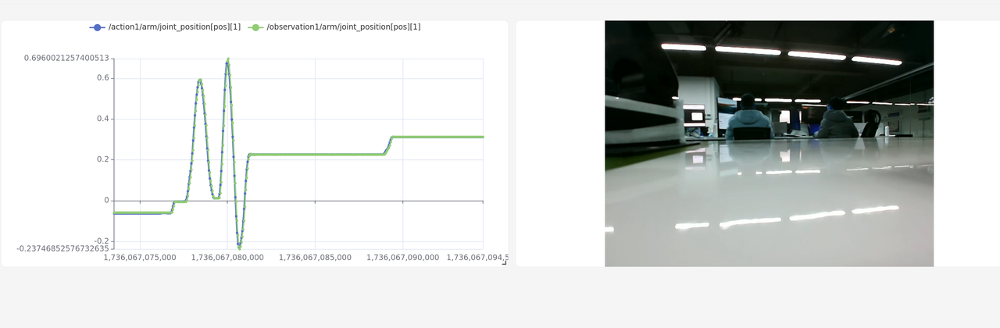

# AIRBOT MCAP Data Viewer 使用说明

联系售后获取相关文件。

## 支持类型

支持查看默认MCAP格式的数据：

- 消息数据：支持Schema为`airbot_fbs.FloatArray`的`FlatBuffers`消息数据查看
- 附件数据：支持查看存储在附件中的视频数据
- 元信息数据：不支持查看

## 使用方法

双击`data_viewer`文件夹中的`index.html`文件在浏览器中打开：

    

然后点击左上角的蓝色浏览图标：

    

在新出现的小窗体中选中需要查看的`mcap`格式数据文件，然后点击`OK`：

    

然后在右侧浮窗中选中要查看的数据文件（底色变蓝）：

    

然后点击左侧的`+`号选择要可视化的数据类型（图表或视频）：

    

选择后右侧会增加一栏窗口，右键该窗口：

    

选择蓝色的设置按钮，然后可以在`Topic`栏中筛选要显示的数据名称，然后点击`OK`/`确定`：

    

选择完毕后点击下图所示窗口上方的播放控制按钮对数据进行动态可视化：

    

可视化效果如下图所示：

    

