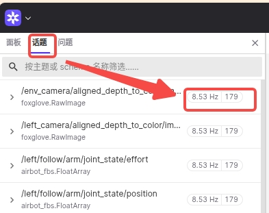
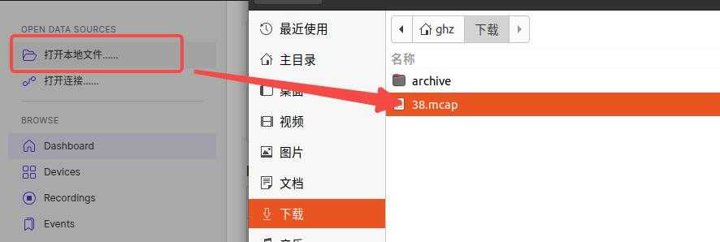
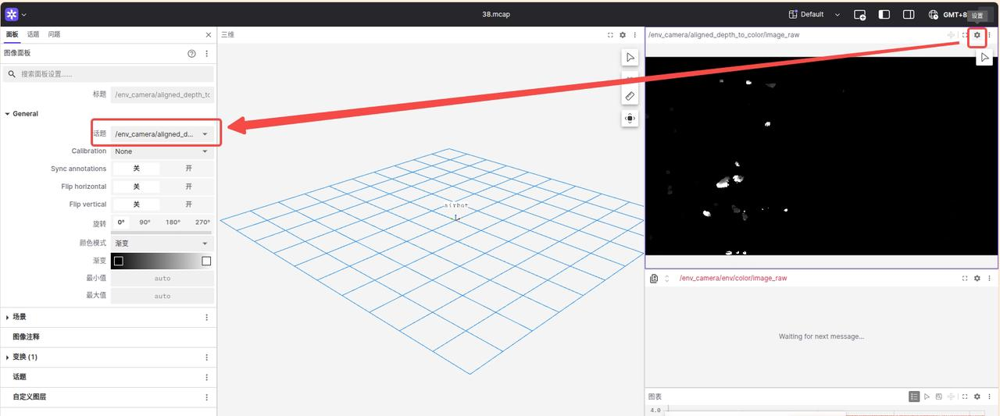
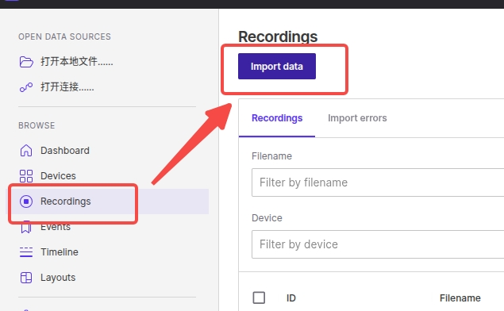
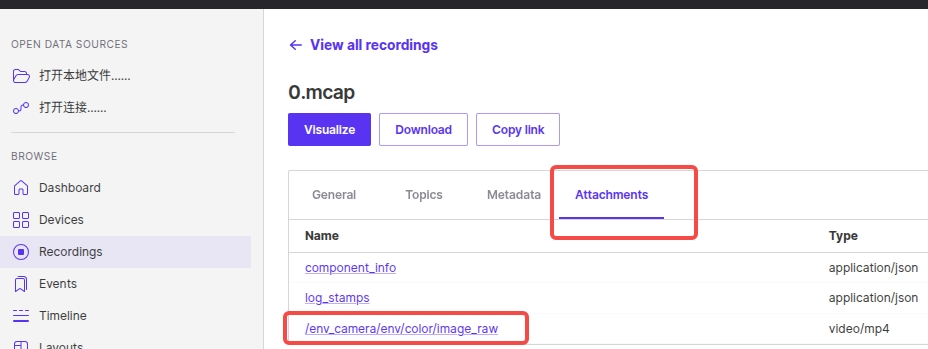

# Foxglove 可视化使用说明

网页链接：https://app.foxglove.dev/361de8be/dashboard

## 话题信息

查看帧率和帧数：

<p align="center">
    
</p>

## 可视化深度图

<p align="center">
    
    
</p>

## 可视化彩色视频

### 方法一：网页端下载视频

由于视频默认保存在`attachment`中，无法直接可视化，需要下载后本地查看。可以通过[recordings](https://app.foxglove.dev/361de8be/recordings/list)上传数据：

<p align="center">
    
</p>

然后下载视频查看：
<p align="center">
    
</p>

### 方法二：使用 mcap 命令行工具导出视频

可以基于`mcap`命令行工具将视频导出为本地文件。首先执行如下命令安装`mcap`命令行工具：

```bash
/bin/bash -c "$(curl -fsSL https://raw.githubusercontent.com/Homebrew/install/HEAD/install.sh)"
brew install mcap
```

然后执行如下命令导出视频文件：

```bash
mcap get attachment <name>.mcap -n "<attachment_name>" -o <output_name>.mp4
```
