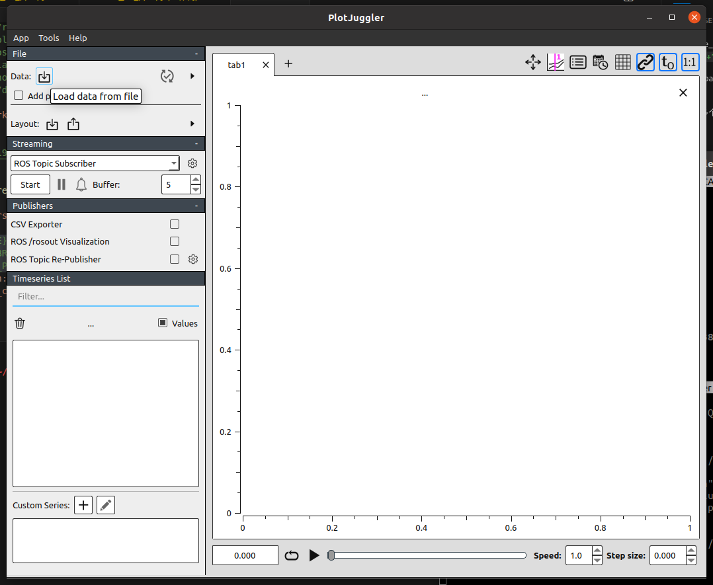
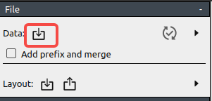
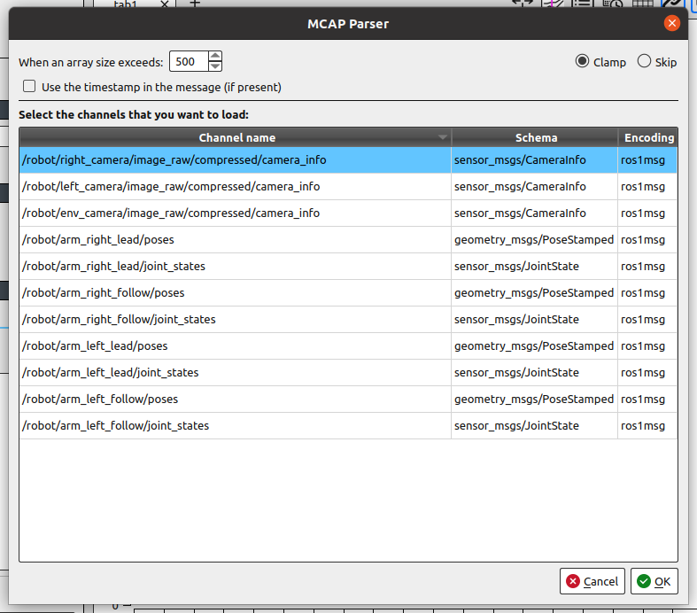
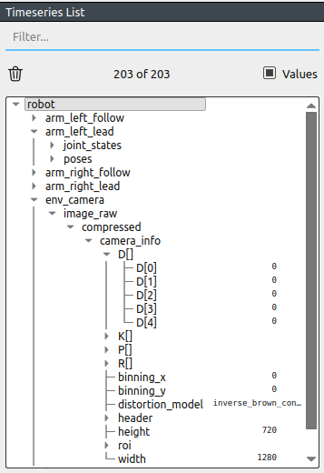

# PlotJuggler 可视化使用说明

官网：https://plotjuggler.io/

## 支持类型

- 支持查看ROS1和ROS2的rosbag数据（包括MCAP格式）
- 支持重新发布数据从而可以在RViz等ROS工具中查看
- 支持其他多种数据格式（如CSV、ULog等）

## 安装使用

可以通过以下命令安装`PlotJuggler`的ROS支持包：

```bash
sudo apt install ros-$ROS_DISTRO-plotjuggler-ros
```

然后运行如下命令启动：

```bash
rosrun plotjuggler plotjuggler
```

<p align="center">
    
</p>

更多安装和使用说明请参考[官方GitHub仓库](https://github.com/facontidavide/PlotJuggler?tab=readme-ov-file)。

## 导入数据

可以通过菜单栏的`File -> Data`导入数据文件：

<p align="center">
    
</p>

点击后会弹出文件选择窗口，选择需要导入的文件后，如果文件格式正确，会弹出对应文件的`Parser`窗口，可以选择加载哪些数据通道，例如：

<p align="center">
    
</p>

选择完成后点击`OK`即可加载数据，加载完成后会在左侧的`Timeseries List`栏中按名称层级显示所有可用的数据通道，展开可看到对应的数据，例如：

<p align="center">
    
</p>

## 可视化

可以通过拖拽左侧的`Timeseries List`中数据的最后一级标量字段到中间的绘图区域来绘制。更多可视化操作请参考官方文档。

注意：ROS1格式的MCAP文件可能会出现`JointState`等类型消息的字段解析不完整的问题（例如仅有header字段）。
